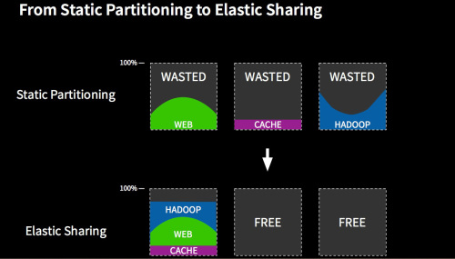
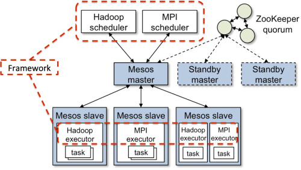

# 对Kubernetes和Mesos做一次比较

### 1. 为何而生
<br/>
如上图所示，如果我们以机器分组的形式去运行业务或任务，即静态的分配计算资源（以"机器"为单位），将造成每台机器的利用率很低。如果我们可以弹性的将多个任务尽可能的叠加到尽量少的机器上，而又不影响各个任务的运行效率，即将单机的计算资源尽可能榨干，那可以节省出来很多机器。这对小公司而言可能并不能怎样，但对Google, Alibaba，AWS这样的巨型互联网公司可是能节省一笔巨大的IT开销的。所以说不管是K8S/Mesos，还是前辈Borg系统都是为了提高数据中心的计算资源的利用率，将不同的计算任务动态的叠加或调度到尽可能少的服务器上去执行，将资源的利用率最大化。

### 2. 架构对比
严格来说，将k8s与mesos放在一起比较是不合适的，虽说都是为了解决集群计算资源利用率问题，但两者的出发点并不同。
```
Kubernetes is an open-source system for automating deployment, scaling, and management of containerized applications.
```
```
Apache Mesos abstracts CPU, memory, storage, and other compute resources away from machines (physical or virtual), enabling fault-tolerant and elastic distributed systems to easily be built and run effectively.
```
从两者的官网描述来看，k8s主要是从容器作为出发点去分配与调度集群计算资源，更接近业务应用，其已经成为容器集群编排的事实标准。而mesos关注的更底层一点，将集群的CPU，内存等计算资源抽象成一个资源池，其出发点是分布式计算资源管理，类似于单机上linux内核的作用，所以被称为分布式系统的内核。<br/><br/>
下面从架构方面看看两者的异同：

<br/>
k8s是通过集群的node结点上的kubelet来收集每台机器上可用的计算资源，然后在master上统一管理。当用户需要运行新的任务时，master上的调度器是以pod(一个pod可以包含多个容器实例，每个容器可以定义或限制自己需要多少计算资源)为基本单位调度到某一个合适的node上执行。其上更适合运行7*24小时长期运行的应用，如web应用。其从1.2版本之后已开始支持批处理，但就目前来说将MapReduce或MPI作业搬到容器上运行需要做的适配工作量很大。

<br/>
mesos做的更开放一点，采用了两级调度框架：第一层，由mesos将计算资源(由mesos slave节点采集并发送给mesos master聚合)分配给Framework(计算框架，如：Hadoop，Spark等，需要应用自己去实现)；第二层，Framework自己的调度器将资源分配给自己内部的任务。mesos更像是一个"半成品"，应用需要实现自己的Framework(包括scheduler和executor两部分)，然后注册给mesos, 然后mesos提供合适的计算资源供Framework自己"折腾"。其比较适合由自己特殊计算模型(或框架)的任务。<br/><br/>
综上所述，k8s将计算资源用容器(如docker)包装起来供业务使用，更简单易用。mesos通过两级调度框架，将资源分配与任务调度解耦，资源的使用方式由Framework自己的实现决定，可定制性更强，但需要开发自己的Framework，需要的技术能力更高一点。当然如果想在mesos上跑容器应用可以直接使用一个已经开发好的mesos framework: [Marathon](http://mesosphere.github.io/marathon/)。


### 3. kubernetes on mesos
从上面的介绍可知kubernetes更擅长容器应用，而一些大数据作用更适合通过Framework跑在mesos上，也就是说不同的应用（workload）需要的运行环境不同，如果我们能将k8s作为一个framework跑在mesos上, 使用起来将会更灵活，然后在作业管理和应用管理这一层，比如跑大数据会用Spark；跑管理容器相关的时候，可以跑一些Kubernetes 、Marathon这样的功能。理想很美好，但现实很骨感，如k8s并没有把资源管理这一层抽象出来，因此让k8s直接使用mesos的资源管理是比较复杂的一件事。如果你关心这个项目的进展，可以看[这里](https://github.com/kubernetes-incubator/kube-mesos-framework)。
